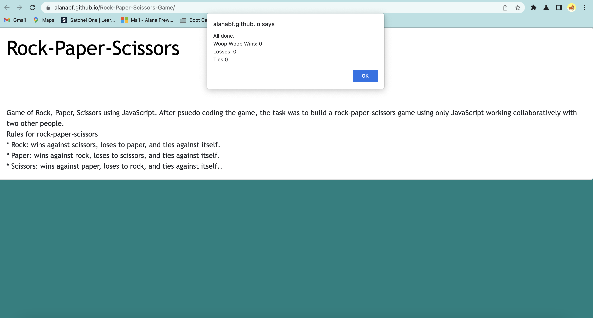

# Rock-Paper-Scissors-Game

Game of Rock, Paper, Scissors using JavaScript.
After psuedo coding the game, the task was to build a rock-paper-scissors game using only JavaScript.

**Rules for rock-paper-scissors**

* Rock: wins against scissors, loses to paper, and ties against itself.
* Paper: wins against rock, loses to scissors, and ties against itself.
* Scissors: wins against paper, loses to rock, and ties against itself.

### Instructions

* Userstory:
  * I want to play Rock, Paper, Scissors against an automated opponent.
  * I can enter R, P, or S to signify my choice of rock, paper, or scissors.
  * I expect the computer to choose R, P, or S in return.
  * I want the option to play again whether I win or lose.
  * I want to see my total wins, ties, and losses after 10 rounds.

* The computer's selection must be random to ensure a fair game.

<https://alanabf.github.io/Rock-Paper-Scissors-Game/>

## Installation

N/A

## Usage

This is a traditional game of rock, paper, scissors to demonstrate newly acquired javascript skills. The instructions will pop up on screen for 10 rounds of rock, paper, scissors, played against the computer. At the end it will display the final results for wins, losses, draws.

 Picture of website

## Credits

N/A

## License

MIT

---
